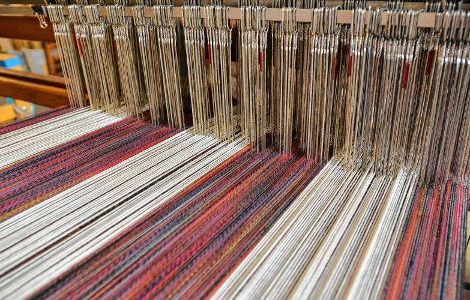
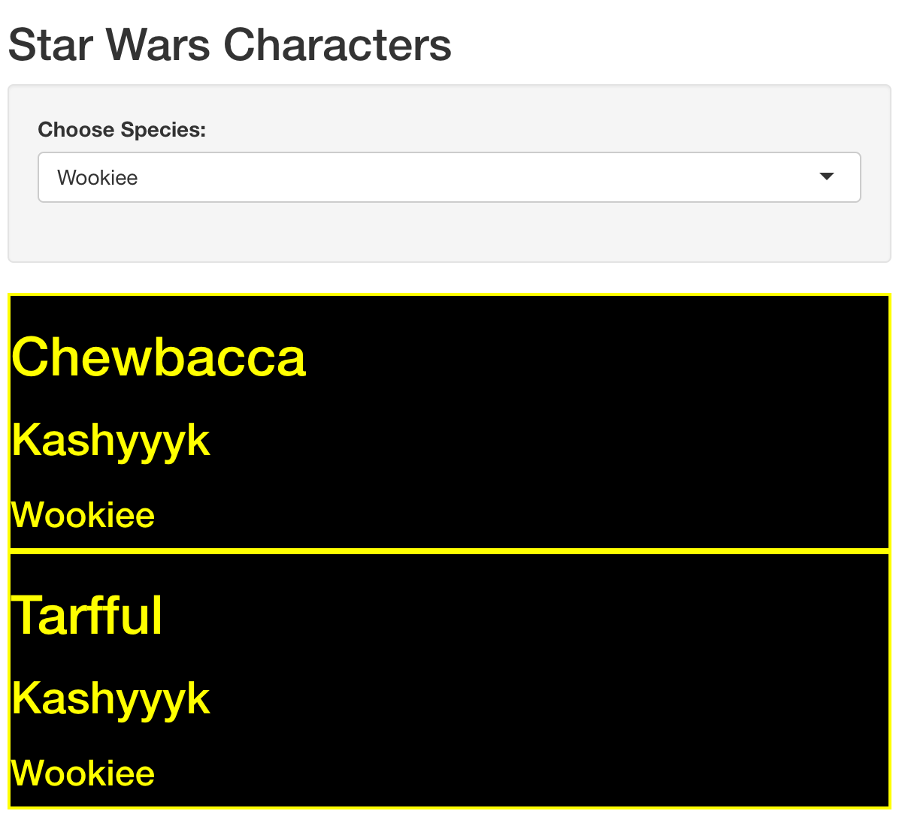

Here is one way to generate dynamic html for your [Shiny app](https://shiny.rstudio.com/) from a reactive data frame using my favorite [tidyverse package purrr](https://purrr.tidyverse.org/) and specifically the [pmap function](https://purrr.tidyverse.org/reference/map2.html).

I've created a shiny app that uses the starwars dataset included with dplyr. The user selects a species from a drop down. Then for each character who belongs to that species some sweet html is generated that displays their name in a `<h1>` tag, their home planet in a `<h2>` tag and their species in a `<h3>` tag.  The whole thing is wrapped in a div with some sick css styling.  Here is a screenshot.
.  Once I publish this app I'm pretty sure I'll be able to retire on the revenues it generates.

So, how to generate one chunk of html per row of the starwars tibble? Here is one way - I look forward to hearing about others.

I start writing a little function that will take the variables I'm interested in and use the html helper functions from shiny.

```{r libraries, warning=FALSE, message=FALSE}
library(shiny)
library(purrr)
library(dplyr)

```


```{r}
# define starwars ui creating helper function
star_wars_ui <- function(name, homeworld, species){
    div(style = "background: black; border: 2px solid yellow; color: yellow",
        h1(name),
        h2(homeworld),
        h3(species)
    )
}
```

And here is what it returns

```{r ui example, results='markup'}
star_wars_ui("Adam", "Earth", "Human") %>% print()
```

which will look like this

```{r ui examplemarkup, echo=FALSE}
star_wars_ui("Adam", "Earth", "Human")
```

All of those helpers, `h1`, `div` etc return an object of *class shiny.tag*, which has the *type list* and a *length of 3*.  A list? That's a good sign I'm going to be reaching for purrr real soon.

```{r shiny tag}
my_div <- div()
class(my_div)
typeof(my_div)
length(my_div)
```

In the code for the app I want to create. I am going top `filter` the dataset by species, then `mutate` a new column to hold the html for each character and then `pull` just that column.  All this will happen in a call to `shiny::renderUI`.
This attempt fails

```{r fail, eval=FALSE}
filter(starwars, species == "Droid") %>%
  mutate(display = star_wars_ui(name, homeworld, species)) %>%
  pull(display)

# Error: Column `display` must be length 5 (the number of rows) or one, not 3
```

When you are mutating a dataframe the thing you are mutating to for each row needs to be of **length 1** (mostly, I won't get into the number of rows variant).
Our function always returns a list of length three for each character. What to do?

`purrr::pmap()` FTW!!

`pmap` takes a list of vectors (remember that a data frame, tibble is a list of vectors) and a function.  The length of the list, i.e the number of vectors it contains, determines the number of arguments that the function will be called with.  That is to say each vector in the list will be an argument to the function, and it will be called once per item in the vectors , aka once per row.  Each time it runs we get a list back but a list of length 1 (with our other list of length 3 inside that, TURTLES!!)
We can't just do something like

```{r demo works, eval=FALSE}
pmap(starwars, star_wars_ui)
```

because our function only accepts 3 arguments and the starwars tibble is a list of 13 vectors.
We have a couple of options for this first argument to `pmap`.
We could add a `select` before the call to `pmap` and refer to the tibble as `.`
in `pmap`

```{r select}
filter(starwars, species == "Wookiee") %>%
  select(name, homeworld, species) %>%
  mutate(display = pmap(., star_wars_ui) ) %>%
           pull(display)
```

or we can create a list from the three vectors inside the `pmap` function

```{r list}
filter(starwars, species == "Wookiee") %>%
  mutate(display = pmap(list(name, homeworld, species), star_wars_ui) ) %>%
           pull(display)
```

Note we could call tibble or data.frame (stringsAsFactors = FALSE !!) instead of list

```{r tibble}
filter(starwars, species == "Wookiee") %>% 
  mutate(display = pmap(tibble(name, homeworld, species), star_wars_ui) ) %>% 
           pull(display)
```

```{r data.frame}
filter(starwars, species == "Wookiee") %>% 
  mutate(display = pmap(data.frame(name,
                                   homeworld,
                                   species,
                                   stringsAsFactors = FALSE),
                        star_wars_ui) ) %>% 
           pull(display)
```

I think we are done. purrr and pmap for the win yet again. Just need to put our ui function and our data wrangling pmapping code into our Shiny app.
[Jenny Bryan has a great walkthrough of pmap examples](https://github.com/jennybc/row-oriented-workflows/blob/master/ex06_runif-via-pmap.md)
Here is the app code, please don't use it to scoop me on the riches from this app.

```{r  app , eval=FALSE}
#
# This is a Shiny web application. You can run the application by clicking
# the 'Run App' button above.

library(shiny)
library(dplyr)
library(purrr)

# define starwars ui creating helper function
star_wars_ui <- function(name, homeworld, species){
    div(style = "background: black; border: 2px solid yellow; color: yellow",
        h1(name),
        h2(species),
        h3(homeworld)
    )
}

# Define UI for application
ui <- fluidPage(

    # Application title
    titlePanel("Star Wars Characters"),

    # Sidebar with a select input for species
    sidebarLayout(
        sidebarPanel(
                shiny::selectInput("species",
                                   "Choose Species:",
                                   choices = unique(starwars$species)
        )
        ),

        # Show a ui with species's character's chracteristics
        mainPanel(
            shiny::uiOutput("ui_output")
            
        )
    )
)


# Define server logic to filter dataframe and create ui from dataframe variables
server <- function(input, output) {

    output$ui_output <- renderUI({
        # generate ui based on input$species from ui.R
                 
                starwars %>% 
                    filter(species == input$species) %>% 
                    mutate(display = pmap(list(name, species, homeworld),
                                          star_wars_ui)
                           ) %>% 
                    pull(display) 
    })
}

# Run the application 
shinyApp(ui = ui, server = server)
```


